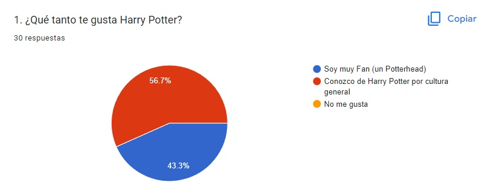
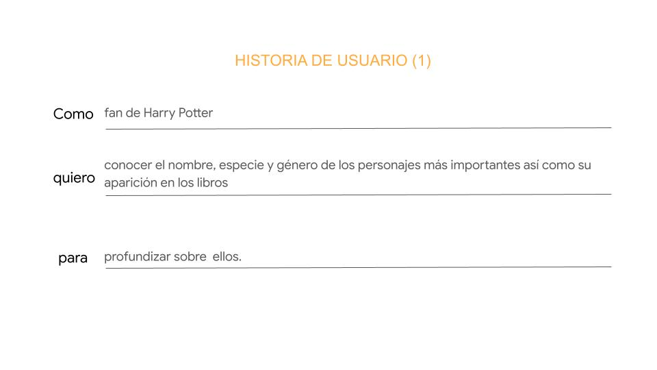
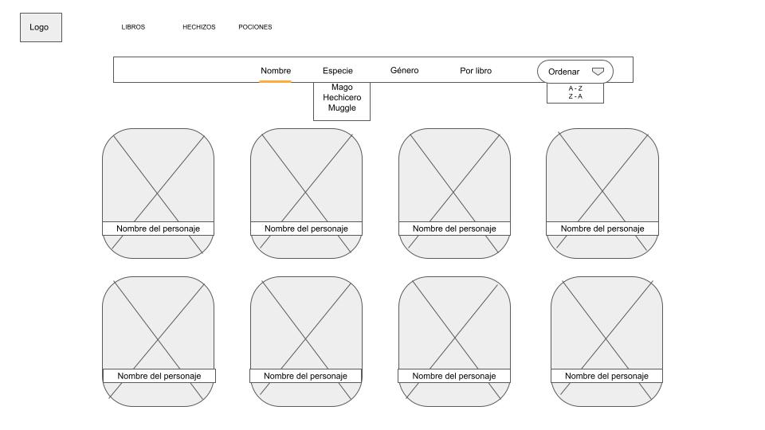

# Data Lovers

## Welcome to plataform 9 ¾

## Introducción

El siguiente proyecto está orientado a mostrar data sobre el mundo de Harry Potter a los interesado o fánaticos de esta famosa saga de manera más interactiva en una interfaz amigable para el usuario.

## ¿Quiénes son los principales usuarios de producto?

De acuerdo a la investigación realizada por medio de una encuesta a un grupo de 30 personas, se logró definir a los usuarios objetivos de este tipo de contenido, resultando en fanáticos de Harry Potter (Potterheads) y cinéfilos conocedores de la saga.

## ¿Cuáles son los objetivos de estos usuarios en relación con el producto?

En esta investigación, se logró definir las preferencias del usuario al revelarnos qué tipo de información deseaban encontrar en la página web. Las siguientes imágenes muestran de forma detalla las historias de usuario que se pudieron definir y los criterios de aceptación y definición de terminado para cumplir con los requerimientos de los usuarios.

### Historia de usuario 1

---

---

### Historia de usuario 2

---

## Proceso de creación de prototipos (de baja y alta fidelidad)

Como resultado de las historias se idearon prototipos (sketch) de las interfaces que estarían utilizando los usuarios para vizualizar el contenido con opciones de filtrados y ordenamiento de la data de acuerdo a sus preferencias.

### Home page

### Character page

### Books page

Por consiguiente se elaboraron los prototipos de alta fidelidad empleando la herramienta Figma, sin embargo, estos sufrieron cambios más adelante de acuerdo a la interacción de los usuarios con el producto. Se podrán vizualizar estos diseños en el siguiente link: https://www.figma.com/file/VX9hdJAuLYReX1NLluBQgp/Harry-Potter-website?node-id=2%3A2

## ¿Cuándo utilizan o utilizarían el producto?

Teniendo encuenta a los usuarios definidos para este producto, los mismo indicaron que podrían acceder a esta web cuando quieran profundizar sobre personajes o descubrir más detalles sobre los libros. Este interés suele aparecer cuando los fan o cinéfilos ven alguna de las películas y desean acceder a una plataforma que contenga dicha información, como lo es este proyecto "Welcome to plataform 9 ¾".

## Ver página web aquí 👇

Link:
